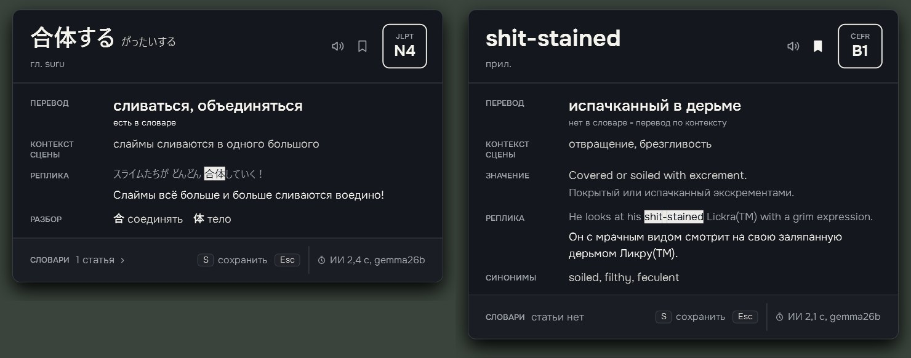
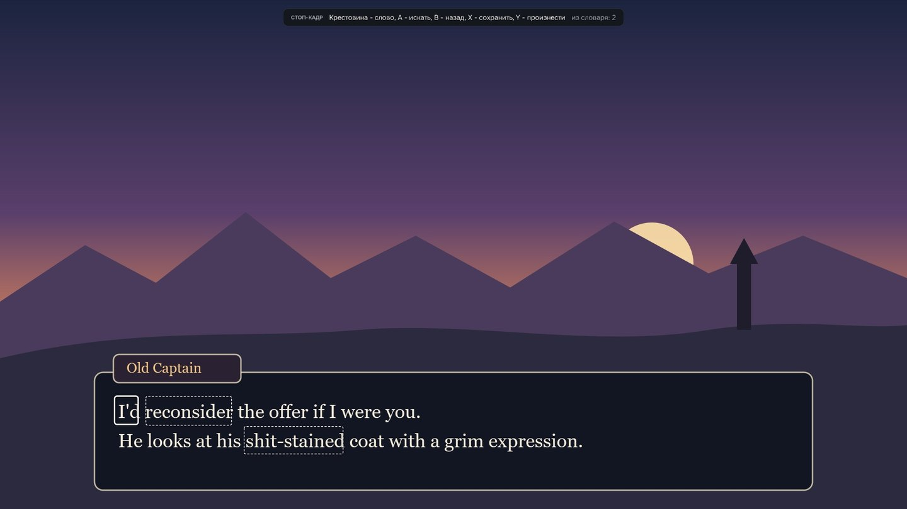
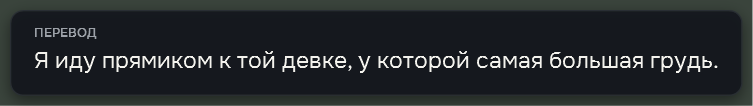
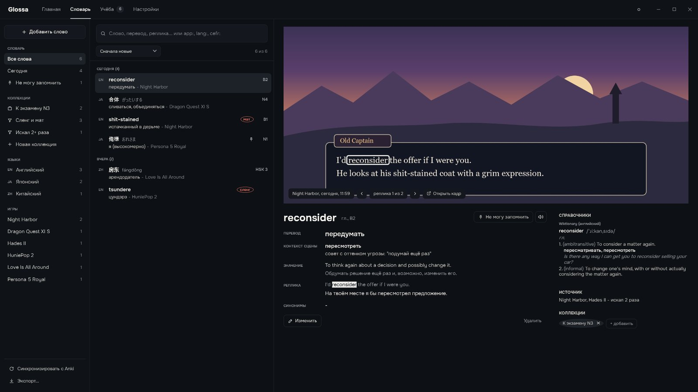
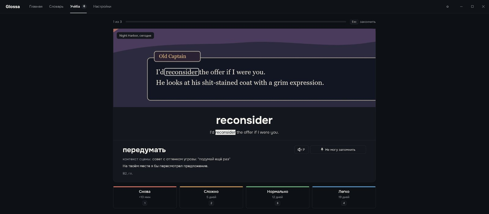

<h1 align="center">Glossa</h1>

<p align="center">
  <b>Экранный словарь для игр.</b> Наведи курсор на слово в игре, нажми <b>Alt+Q</b> - рядом откроется карточка
  с переводом по смыслу сцены.<br>
  <i>Английский, японский и китайский -> русский. Локальная модель, без интернета. Мат и сленг - как есть.
  Слова из игр потом повторяются по расписанию, как в Anki.</i>
</p>

<p align="center">
  <a href="https://github.com/Victor21123/glossa/releases/latest"></a>
  
  
  
  <a href="LICENSE"></a>
</p>

<p align="center">
  <a href="https://github.com/Victor21123/glossa/releases/latest">
    
  </a>
</p>

<p align="center">
  <a href="#возможности"><b>Возможности</b></a> |
  <a href="#модели-и-движок"><b>Модели</b></a> |
  <a href="#установка"><b>Установка</b></a> |
  <a href="#приватность"><b>Приватность</b></a> |
  <a href="#лицензия"><b>Лицензия</b></a>
</p>

<p align="center">
  
</p>

---

## Что такое Glossa

Играешь в игру на английском, японском или китайском и встречаешь незнакомое слово. Glossa находит его прямо на
экране: снимает кадр, распознаёт текст, берёт слово под курсором и всю реплику. Сначала сразу показывает статьи
словарей, следом - перевод слова и реплики от локальной языковой модели, которая видит контекст сцены. Фокус у игры
не отбирается, карточка закрывается клавишей Esc.

Каждое найденное слово попадает в "Словарь" вместе с кадром из игры и репликой. Оттуда слова уходят в "Учёбу":
повторение по расписанию один в один как в Anki, где на лицевой стороне карточки - та самая сцена из игры. Или
в сам Anki, если привычнее он.

Всё работает на твоём компьютере. Интернет нужен, только чтобы по кнопке скачать модель, движок или справочник.

## Возможности

| Раздел | Что делает |
|---|---|
| **Карточка слова** | Перевод по смыслу сцены, контекст, значение, реплика с переводом, синонимы, чтение и пиньинь, разбор иероглифов, уровни JLPT / HSK / CEFR, пометки "мат" и "сленг" |
| **Только перевод** | Без словаря и учёбы: перевод реплики под курсором, всего экрана абзацами или живые субтитры поверх игры |
| **Словарь** | Слова с кадрами и репликами, коллекции вручную и по фильтру, поиск, правка, экспорт в Anki (`.apkg`, AnkiConnect), Quizlet и CSV, озвучка голосами Windows |
| **Учёба** | Расписание повторений Anki (SM-2, те же шаги, интервалы и разброс), сессии по языку и игре, пометка "Не могу запомнить", серия дней |
| **Игры** | Профиль на каждую игру, стоп-кадр для игр, которые держат курсор, пауза игры на время карточки, геймпады, кнопки мыши 4/5, отметки знакомых слов на стоп-кадре |
| **Справочники** | Каталог с установкой из программы (Warodai, JMdict, БКРС, CC-CEDICT, Wiktionary), импорт DSL, StarDict, MDX, Yomitan |
| **Нагрузка** | Модель выгружается без дела и уступает видеопамять игре, низкий приоритет, распознавание на процессоре в несколько потоков |
| **Оформление** | Тёмная, светлая и "Диско" темы; вид карточки: "Меньше", "Стандарт", "Больше" или "Свой" с прозрачностью и цветом |

### Карточка слова

Словари отвечают сразу, модель дописывает поля по мере ответа: первое поле - примерно через 0,4 с, вся карточка -
за 2,5-3,5 с на видеокарте с 16 ГБ. Модель переводит не слово вообще, а слово в этой реплике, и объясняет, почему здесь
именно так ("Контекст сцены"). Мат и сленг переводятся с тем же регистром, без смягчений.

Клавиши, пока карточка открыта: **S** - сохранить, **P** - произнести, **Tab** - подробнее, **Esc** - закрыть.

### В игре: стоп-кадр и геймпад

<p align="center">
  
</p>

Для игр, которые прячут курсор или не любят, когда их окно теряет фокус, Glossa останавливает кадр и показывает
карточку на снимке. С геймпада (например, LB + RB) слово выбирается крестовиной, A - искать, X - сохранить.
Слова, которые уже есть в словаре, отмечены прямо на кадре; трудные - заметнее.

### Только перевод

<p align="center">
  
</p>

Режим для тех, кому нужен просто перевод, без словаря и учёбы:

- **Реплика** - перевод всей реплики под курсором, около 1,5 с;
- **Весь экран** - кадр останавливается, поверх каждого абзаца ложится его перевод;
- **Живой перевод** - Glossa следит за экраном и переводит каждую новую реплику субтитром над ней.

### Словарь

<p align="center">
  
</p>

Одно слово - одна запись, сколько бы реплик с ним ни встретилось: реплики листаются, у каждой свой кадр и свой
перевод. Коллекции собираются вручную или по фильтру ("сленг и мат", "искал 2 раза и больше"), статьи справочников
открываются рядом. Экспорт в Anki - колодой `.apkg` или напрямую через AnkiConnect.

### Учёба

<p align="center">
  
</p>

Расписание перенесено из Anki один в один: учебные шаги 1 и 10 минут, дальше интервалы в днях с учётом лёгкости
слова, разброс и выравнивание нагрузки. На кнопках - настоящий следующий интервал для этого слова. Сессия собирается из слов с
пометкой "Не могу запомнить" (до половины), слов, которым пора, и новых (20 в день); фильтр по языку и игре. Клавиши:
**Пробел** - перевод, **1-4** - ответ, **P** - произнести, **Esc** - закончить.

## Модели и движок

Модели и llama.cpp не входят в сборку - они скачиваются из программы: **Настройки -> ИИ и модели -> "Скачать"**.
Каждый файл закреплён за версией и контрольной суммой SHA-256, прерванная загрузка продолжается с места.

| Модель | Файл | Видеопамять |
|---|---|---|
| Gemma 4 26B A4B (по умолчанию) | [UD-IQ4_XS, 13,4 ГБ](https://huggingface.co/groxaxo/Huihui-gemma-4-26B-A4B-it-abliterated-GGUF) | ~13 ГБ; в режиме "минимум видеопамяти" ~3 ГБ |
| Gemma 4 12B | [Q4_K_M, 7,4 ГБ](https://huggingface.co/culturerevolt/gemma-4-12b-heretic-abliterated-GGUF) | ~7 ГБ |
| Gemma 4 E4B - для слабых ПК | [Q4_K_M, 5,3 ГБ](https://huggingface.co/TrevorJS/gemma-4-E4B-it-uncensored-GGUF) | ~3 ГБ |
| Своя модель | любой GGUF-файл | - |

Движок - официальный релиз [llama.cpp](https://github.com/ggml-org/llama.cpp) (b11243): для NVIDIA - сборка
CUDA 13.4 (карты Turing и новее, драйвер 580+), для остальных видеокарт - Vulkan. Программа предлагает подходящую
сама. Вместо локальной модели можно подключить своё API: OpenAI-совместимые, Anthropic, OpenRouter, DeepSeek, Gemini,
LM Studio, Ollama (ключи хранятся зашифрованными).

## Установка

> [!NOTE]
> Первая версия ещё не выпущена. Пока Glossa собирается из исходников - см. "Сборка из исходников" ниже.

1. Скачай архив со страницы [Releases](https://github.com/Victor21123/glossa/releases/latest) и распакуй в любую папку.
2. Запусти `Glossa.exe`: программа сядет в трей.
3. Открой **Настройки -> ИИ и модели** и нажми "Скачать" у модели и движка.
4. Запусти игру, наведи курсор на слово и нажми **Alt+Q**.

| | Минимум | Рекомендуется |
|---|---|---|
| Система | Windows 10/11, 64 бита | Windows 11 |
| Память | 16 ГБ | 32 ГБ |
| Видеокарта | 6 ГБ (модель E4B) или без неё, со своим API | 16 ГБ (Gemma 4 26B целиком) |
| Диск | 10 ГБ | 25 ГБ на SSD (модель, движок, справочники) |

## Приватность

- Кадры, слова и история учёбы лежат только на твоём компьютере (папка данных Glossa).
- Модель работает локально. Сеть нужна, только когда ты сам нажимаешь "Скачать" (модель, движок, справочник) или
  подключаешь своё API.
- Ключи API хранятся зашифрованными средствами Windows (DPAPI).

<details>
<summary><b>Как это устроено</b></summary>

- Снимок экрана - DXGI; об играх в эксклюзивном полноэкранном режиме Glossa предупреждает заранее.
- Распознавание текста - PP-OCRv5 (RapidOcrNet, ONNX) на процессоре.
- Японский - границы слов, словарная форма и чтение по UniDic; китайский - слова и пиньинь по CC-CEDICT.
- Справочники - свои пакеты SQLite, поиск по словарной форме и устойчивым выражениям.
- Модель - llama-server из официальной сборки llama.cpp; веса подгоняются под свободную видеопамять с запасом для
  игры, ответ приходит строгим JSON по схеме и показывается по мере генерации.
- Словарь и история учёбы - SQLite; расписание - перенос планировщика Anki (v3, SM-2) с тестами на все его примеры.
- Интерфейс - WPF на .NET 8, шрифты Onest и Literata.

</details>

<details>
<summary><b>Сборка из исходников</b></summary>

Нужны Windows 10/11 x64 и [.NET 8 SDK](https://dotnet.microsoft.com/download/dotnet/8.0).

```
dotnet build src/Glossa.App
dotnet test src/Glossa.Tests
```

`tools/publish.ps1` собирает Release и ставит копию в `D:\Programs\Glossa` с ярлыком на рабочем столе.

Данные программы лежат в `D:\GlossaData` (другое место - переменная окружения `GLOSSA_DATA`). Пока нет мастера
первого запуска, туда нужно положить:

- модели распознавания - `tools/export_ocr_models.py` (берёт их из Python-пакета `rapidocr`);
- UniDic для японского - содержимое пакета `unidic-lite` в `dict\unidic-lite`.

Справочники, модели и llama.cpp ставятся из программы. `glossa-cli` (`src/Glossa.Cli`) - то же без окна: установка и
проверка словарей, загрузка llama.cpp, прогон перевода на наборе реплик.

</details>

## Лицензия

[GPL-3.0](LICENSE). Шрифты Onest и Literata - SIL Open Font License 1.1 (`src/Glossa.App/Assets/Fonts`).
llama.cpp (MIT), модели и словари скачиваются отдельно и распространяются на своих условиях. Игровая сцена на снимках
экрана нарисована самой программой для примера.
